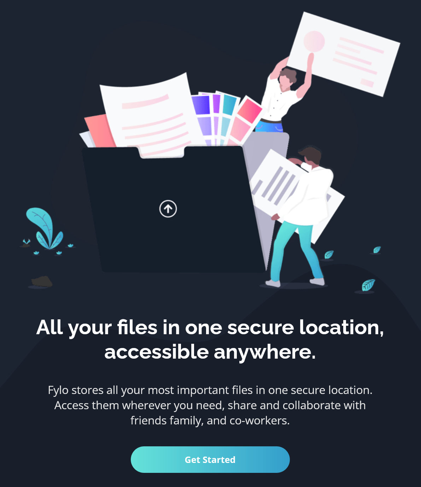

# Frontend Mentor - Fylo dark theme landing page solution

This is a solution to the [Fylo dark theme landing page challenge on Frontend Mentor](https://www.frontendmentor.io/challenges/fylo-dark-theme-landing-page-5ca5f2d21e82137ec91a50fd). Frontend Mentor challenges help you improve your coding skills by building realistic projects. 

### The challenge

Users should be able to:

- View the optimal layout for the site depending on their device's screen size
- See hover states for all interactive elements on the page

- [Solution](https://your-solution-url.com)
- [Live Site](https://lspacka.github.io/FEM-fylo-dark-theme-landing-page/)

### Built with

- HTML
- CSS

## Author

- [Frontend Mentor](https://www.frontendmentor.io/profile/lspacka)
- [Twitter](https://www.twitter.com/lspacka)

Social media icons by [Stockio](https://www.flaticon.com/authors/stockio)
